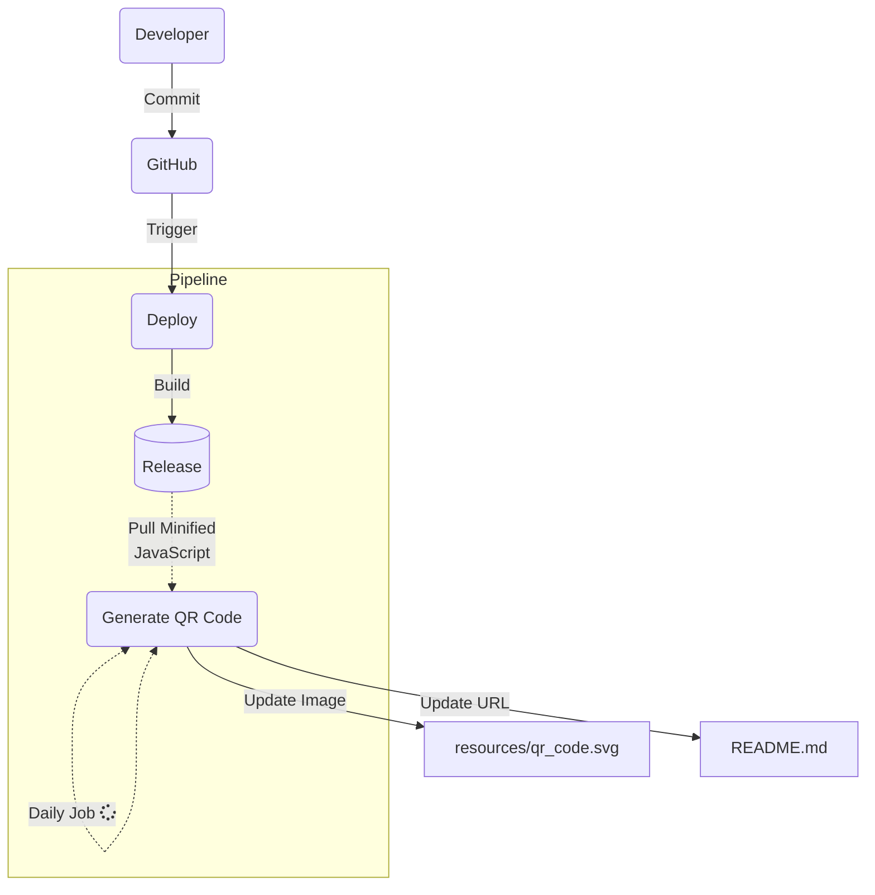

# yz-visitor-pass

[](https://github.com/winstxnhdw/yz-visitor-pass/actions/workflows/main.yml)
[](https://github.com/winstxnhdw/yz-visitor-pass/actions/workflows/generate.yml)
[](https://github.com/winstxnhdw/yz-visitor-pass/actions/workflows/formatter.yml)
[](https://github.com/winstxnhdw/yz-visitor-pass/actions/workflows/dependabot.yml)
[](https://github.com/winstxnhdw/yz-visitor-pass/actions/workflows/github-code-scanning/codeql)

<p align="center">
    <b><a href="https://github.com/winstxnhdw/yz-visitor-pass/tree/ea05a553aaeef3002ea9b0f4b8cfe4e6d1e11bb8#yz-visitor-pass">Go to previous QR Code</a></b>
</p>

<div align="center">
    
</div>

## Installation

```bash
yarn
```

## Usage

```bash
yarn start
```

## Pipeline Architecture

The `Deploy` and `Generate QR Code` Actions are separated to eliminate the redundant step of re-installing/caching dependencies. This separation effectively reduces the time required to generate a Quick Response code. The pipeline architecture can be illustrated with the following.


